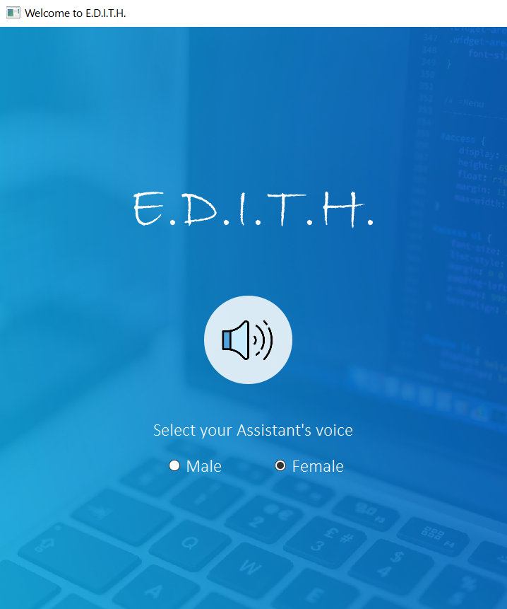

<h1 align="center">E.D.I.T.H.</h1> 

  

 

## About

E.D.I.T.H. assists the end-user with daily activities such as searching queries in various search engines such as Google, searching for videos, retrieving images, live weather conditions, playing videos on YouTube, translating text into different languages, performing system activities like creating files of various types like word file and reminding the user about scheduled events and tasks as a personal assistant. 

Our system is intended to be used on desktop computers and works by taking input in the form of voice or text. If input is in the voice format, then it is converted into text using Speech Recognition.

Machine learning and Natural Language Processing is used to analyze the user statements/commands and provide the best solution.   

## Features

* **Web Search:**  
To assist users by Searching for information on the internet using keywords provided by the user.

* **YouTube:**  
Searching and playing songs/videos from YouTube as per the user.

* **To Do Lists:**  
Maintaining a list of tasks to be completed by the user as per the profile.

* **Emails:**  
Storing contacts and assisting users in sending emails by taking the contact name as input.

* **Reminders:**  
Adding event reminders to calendar and notifying the user about upcoming events.

* **Weather/Time:**  
Reporting the correct time and weather according to the user's location.

* **Images:**  
Capturing screenshots and images from live camera on user’s command.

* **Managing PC Modes:**  
Switching between computer modes like sleep, shut down, etc based on users’ requests.

* **Profile Validation:**  
Users should be able to create profiles. To access personalized services login credentials will be checked and if the user has an existing profile, he/she will be given access, else provided with basic services.

* **Profile Personalisation:**  
This includes learning and storing information for each profile and using it to assist the user. For example, maintaining to-do lists, adding reminders of events to personal calendars, etc.

*For detailed description, please refer to [Project Report](https://drive.google.com/file/d/1BOljQH3an-HAHsVy-KAy33sVT_65mND_/view?usp=sharing)*  

<h2 align="center"><i>Developed by</i></h2>

 
 
 

